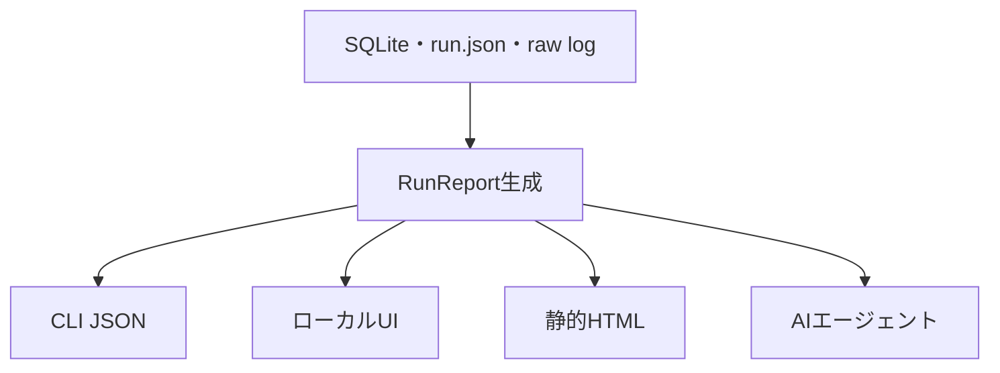

# ReportとUIのアーキテクチャ

人間向けUI、CLI、AI向け出力は、SQLiteやraw logをそれぞれ独自に解釈しません。保存層から一度だけ`RunReport`を生成し、各surfaceは同じ値を描画します。



## 境界

- `storage`はrun IDの解決と保存済みrecordの読み出しを担当します。
- `report::build`はmanifest、metric、transition、artifact pathをcompactな`RunReport`へ正規化します。HTTP、database、CPU、hostのsource選択、単位、派生値、並び順などの意味はここだけに置きます。
- JSON、HTML、将来のHTTP APIは`RunReport`のrendererです。renderer内でSQLite queryや性能診断を行いません。
- raw logは根拠データとして残し、Reportには要約とpathを入れます。UIから根拠へ辿れることを優先します。

この境界により、CLIとUIで数値や順位が食い違うことを防ぎます。現在はJSON、単一fileの静的HTML、localhost限定UIを提供します。UIはrequestごとに最新runの`RunReport`を生成し、`/`をHTML、`/api/report`をJSONとして返します。

## 現在の出力

```console
isuscope report latest
isuscope report latest --full
isuscope report latest --format html --output .isuscope/latest/report.html
isuscope ui
```

HTMLはCSSと元のReport JSONをfile内に埋め込むため、serverやnetwork接続なしで開けます。collector errorやroute文字列はHTML escapeし、埋め込みJSONの`<`もescapeします。

`isuscope ui`にオプションはなく、`127.0.0.1:3000`だけへbindします。最新runがない場合は説明付きのHTTP 500を返し、runを保存して再読込すると表示できるようになります。UIはrunや設定を変更しないread-only surfaceです。

通常Reportにはカテゴリ別coverage、欠測metric、上位20件と全件数だけを含め、raw metricは`full` fieldを出力しません。CLIで`--full`を指定した場合だけ、全summary metric、全series metric、全transitionを`full`へ格納します。UIとAIの初期入力が時系列行数に比例して肥大化しないための境界です。

artifactは必ず対象run配下の圧縮logを`canonical_path`として返します。対象がlatestの場合だけ、cacheである`expanded_path`も返します。過去runのReportが後続runの`latest` artifactを誤参照しないための区別です。
