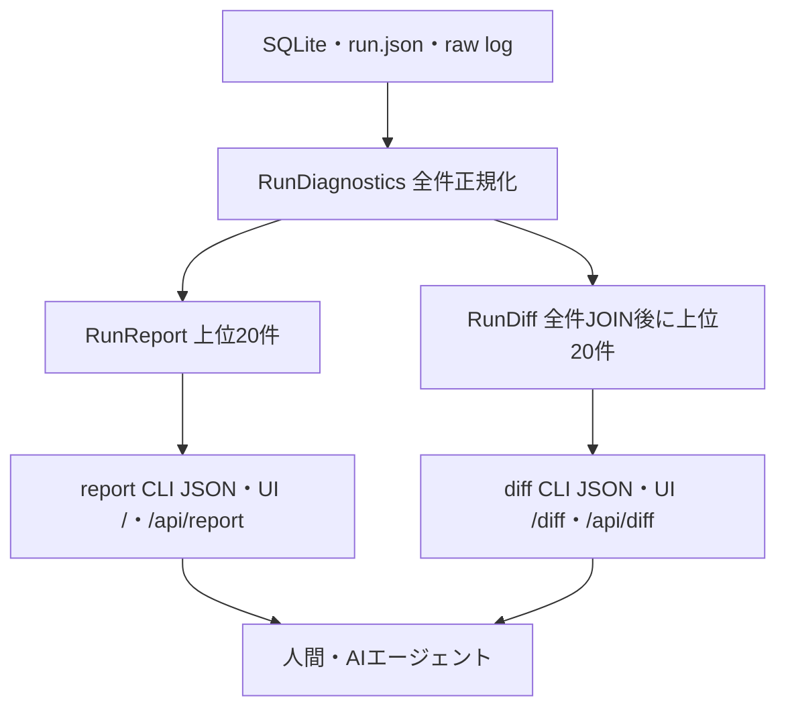

# ReportとUIのアーキテクチャ

人間向けUI、CLI、AI向け出力は、SQLiteやraw logをそれぞれ独自に解釈しません。保存層からlosslessな`RunDiagnostics`へ正規化し、単一runは`RunReport`、2 runの比較は`RunDiff`へ変換して各surfaceが同じ値を描画します。



## 境界

- `storage`はrun IDの解決と保存済みrecordの読み出しを担当します。
- `report::diagnose`はmanifest、metric、transition、artifact pathを全件の`RunDiagnostics`へ正規化します。HTTP、database、CPU、hostのsource選択、単位、派生値などの意味はここだけに置きます。
- 単一runは`RunDiagnostics`からcompactな`RunReport`を生成します。比較時は2つの`RunDiagnostics`を安定keyでfull outer joinし、delta順にcompactな`RunDiff`を生成します。compact済みの`RunReport`同士は比較しません。
- CLI JSON、UI HTML、HTTP APIは`RunReport`または`RunDiff`のrendererです。renderer内でSQLite queryや性能診断を行いません。
- `list`はrun選択だけを担当するschema付きJSONで、性能metricを解釈しません。
- raw logは根拠データとして残し、Reportには要約とpathを入れます。UIから根拠へ辿れることを優先します。

この境界により、CLIとUIで数値や順位が食い違うことを防ぎます。CLIはJSONだけを返し、人間向けHTMLはlocalhost限定UIだけが提供します。UIは`/`と`/api/report`でlatestのReport、`/diff`と`/api/diff`で指定した2 runのDiffを返します。

## 現在の出力

```console
isuscope report latest
isuscope diff BASE_RUN CANDIDATE_RUN
isuscope list
isuscope ui
```

Report UIのHTMLはcoverage、HTTP、database、CPU、host、profile artifact、transition、collectorを表示します。Diff UIはscore、coverage、HTTP、database、CPU symbol、host、transitionのbase・candidate・deltaを表示します。collector errorやroute文字列はHTML escapeし、埋め込みJSONの`<`もescapeします。

`isuscope ui`にオプションはなく、`127.0.0.1:3000`だけへbindします。最新runがない場合は説明付きのHTTP 500を返し、runを保存して再読込すると表示できるようになります。UIはrunや設定を変更しないread-only surfaceです。

Reportには`category × node × collector × phase`単位のcoverage、欠測metric、上位20件と全件数だけを含めます。collectorが成功しても期待metricがなければ`missing`とし、別nodeの成功で`failed`や`unavailable`を隠しません。全metricと全transitionはSQLiteとrunディレクトリを正本とし、Reportへ重複格納しません。これによりUIとAIの入力が時系列行数に比例して肥大化せず、Report schemaもオプションで変化しません。

Diffはcoverageを`section/node/collector/phase`、HTTPを`node/method/route`、databaseを`node/engine/digest/source`、CPUを`node/process/binary/symbol/source`、hostを`node/metric/target/source`、transitionを`from/to`で結合します。片側だけにある項目は`added`または`removed`、両側にある項目は`both`です。数値は`base`、`candidate`、`delta`、`delta_percent`を返し、baseが0または欠測なら割合を`null`にします。

artifactは必ず対象run配下の圧縮logを`canonical_path`として返します。対象がlatestの場合だけ、cacheである`expanded_path`も返します。過去runのReportが後続runの`latest` artifactを誤参照しないための区別です。
